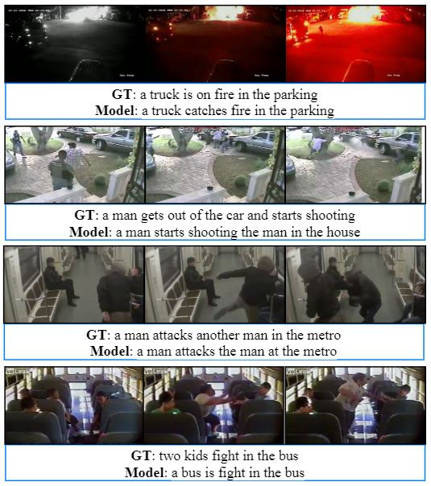

## Automated Captioning of LIVE CCTV Feed

###  Description

The framework combines anomaly detection with video captioning, utilizing the UCF-Crime dataset and UCFC-VD dataset to streamline video monitoring and reporting.

This implementation is based on the following 2 papers: 
  1.[Anomaly detection](https://ieeexplore.ieee.org/document/10205699).
  2.[Video Captioning](https://ieeexplore.ieee.org/document/9084781).

Dataset Used: UCF-Crime for videos and a new caption dataset from the [paper](https://ieeexplore.ieee.org/document/10021309) called UCFC-VD 
The dataset download links for the models are given in their respective directories.

The framework introduced here can be used as a toolbox to completely automate the process of surveillance of video footage and report any anomaly to the user.

---

###  Requirements
The individual requirements for both the models are given in the respective directories

---

###  Testing

To test the code on individual samples using the weights from the pre-trained model:

1. Extract [C3D features](https://github.com/facebookarchive/C3D) using the given [script](https://github.com/Adit31/Captionomaly-Deep-Learning-Toolbox-for-Anomaly-Captioning/blob/main/Anomaly_Detection/Feature_Extractor/Feature_Extractor.ipynb) (Ensure dimensions of 240x320 pixels and frame rate of 30 fps).
2. Use the .txt file generated above to get anomaly scores using [Test_Anomaly_Detector_public.py](https://github.com/Adit31/Captionomaly-Deep-Learning-Toolbox-for-Anomaly-Captioning/blob/main/Anomaly_Detection/Test_Anomaly_Detector_public.py) in the [script](https://github.com/Adit31/Captionomaly-Deep-Learning-Toolbox-for-Anomaly-Captioning/blob/main/Anomaly_Detection/CCTV_Anomaly.ipynb).
3. Use the .txt file generated during the testing with [Save_Anomaly_Clips.py](https://github.com/Adit31/Captionomaly-Deep-Learning-Toolbox-for-Anomaly-Captioning/blob/main/Anomaly_Detection/Save_Anomaly_Clips.py) to get the anomalous part of the video.
4. Extract frames from the clipped video using [Prepare_frames.py](https://github.com/Adit31/Captionomaly-Deep-Learning-Toolbox-for-Anomaly-Captioning/blob/main/Video_Captioning/Feature_Extractor/Prepare_frames.py).
5. Extract [ResNeXt-101 features](https://github.com/taehoonlee/tensornets) for the test video using [generate_res_feature.py](https://github.com/Adit31/Captionomaly-Deep-Learning-Toolbox-for-Anomaly-Captioning/blob/main/Video_Captioning/Feature_Extractor/generate_res_feature.py).
6. Use the .npy file generated above to get the tagging vector using [TestTagging.py](https://github.com/Adit31/Captionomaly-Deep-Learning-Toolbox-for-Anomaly-Captioning/blob/main/Video_Captioning/Tagging_Network/TestTagging.py).
7. Use the .npy files for ResNext features and Tagging network in the [run_model.sh](https://github.com/Adit31/Captionomaly-Deep-Learning-Toolbox-for-Anomaly-Captioning/blob/main/Video_Captioning/Delving_Deeper_into_the_Decoder_for_Video_Captioning/run_model.sh).
8. Check the generated caption in the demo log file.

---

### Training

1. Prepare the Corpus, Reference, Vocabulary and Tagging files using the scripts given [here](https://github.com/Adit31/Captionomaly-Deep-Learning-Toolbox-for-Anomaly-Captioning/tree/main/Video_Captioning/Data_Preparation/Scripts).
2. Extract ResNeXt features of all the videos in a single .npy file using [Prepare_frames.py](https://github.com/Adit31/Captionomaly-Deep-Learning-Toolbox-for-Anomaly-Captioning/blob/main/Video_Captioning/Feature_Extractor/Prepare_frames.py) and [generate_res_feature.py](https://github.com/Adit31/Captionomaly-Deep-Learning-Toolbox-for-Anomaly-Captioning/blob/main/Video_Captioning/Feature_Extractor/generate_res_feature.py).
3. Train the tagging network using [TrainTagNet.py](https://github.com/Adit31/Captionomaly-Deep-Learning-Toolbox-for-Anomaly-Captioning/blob/main/Video_Captioning/Tagging_Network/TrainTagNet.py).
4. Test the tagging network to generate a .npy file using [TestTagging.py](https://github.com/Adit31/Captionomaly-Deep-Learning-Toolbox-for-Anomaly-Captioning/blob/main/Video_Captioning/Tagging_Network/TestTagging.py).
6. Adjust the configurations for the Captioning model in [config.py](https://github.com/Adit31/Captionomaly-Deep-Learning-Toolbox-for-Anomaly-Captioning/blob/main/Video_Captioning/Delving_Deeper_into_the_Decoder_for_Video_Captioning/config.py), and train the Captioning model using [run_model.sh](https://github.com/Adit31/Captionomaly-Deep-Learning-Toolbox-for-Anomaly-Captioning/blob/main/Video_Captioning/Delving_Deeper_into_the_Decoder_for_Video_Captioning/run_model.sh).
7. Check the results the train and test log files.

---

